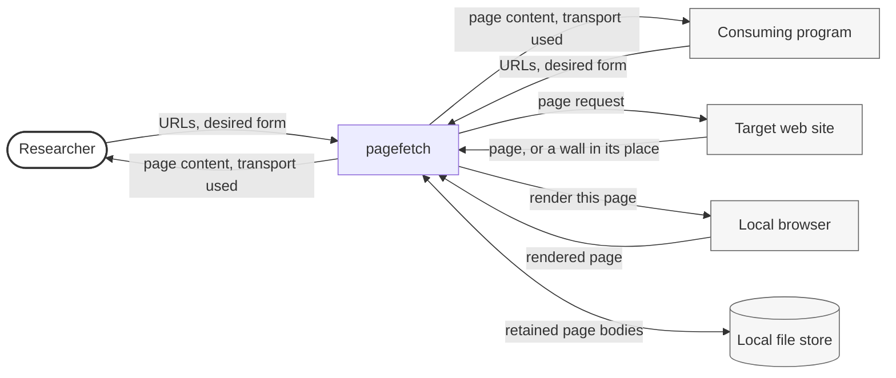

# System Scope and Context

## Business Context

pagefetch sits between someone who wants the content of a page and a site
that may or may not be willing to serve it to an automated client. It takes
URLs and returns page content, and it keeps what it retrieved so the same
request need not be made twice. Everything below is in domain terms;
protocols and directions follow in the Technical Context.

| Partner | Input to pagefetch | Output from pagefetch |
| --------- | -------------------- | ----------------------- |
| **Researcher** (human) | One URL or a list of them, the form the content should take, and optionally a named transport | Page content, the transport that produced it, and a status distinguishing every URL served from none from some |
| **Consuming program** (system) | The same, through a library call rather than a command line | The same, as a value carrying the content, the transport and a success flag |
| **Target web site** (system) | A request for one page | Nothing — the site is read, never written to |
| **Local browser** (system) | A page to render, when the site will not serve one to a plain request | Nothing that outlives the fetch; the browser is started and stopped by pagefetch |
| **Local file store** (system) | Page bodies worth keeping | Previously retained bodies, and the removal of any that turn out not to be pages |

## Technical Context

pagefetch is a library and a command-line entry point running inside the
caller's own process. It has no server, no port, and no background
activity: everything happens within a call. Four channels cross the
process boundary.

### External Technical Interfaces

#### Target web site (outbound)

| Interface | Protocol | Direction | Notes |
| ----------- | ---------- | ----------- | ------- |
| Page retrieval | HTTP, HTTPS | Outbound | Requests are sequential and unauthenticated; no other scheme is accepted at any entry point |

Requests carry a browser-like user agent and ask only for compressions the
plain transport can undo. A response is judged on its body rather than its
status: a site that refuses an automated client commonly does so with a
success status and a page-shaped body.

#### Local browser (outbound, same host)

| Interface | Protocol | Direction | Notes |
| ----------- | ---------- | ----------- | ------- |
| Browser control | Local automation channel over loopback | Outbound | A browser process is started for the fetch that needs it and stopped when that fetch ends |

The browser runs on the same host as the caller and makes the page requests
itself, so a site sees the browser rather than pagefetch. One of the
transports needs a visible window; the others do not. Where the operating
system can attribute a process to its parent, a browser that outlives its
fetch is terminated when the caller's process exits.

#### Local file store (bidirectional)

| Interface | Protocol | Direction | Notes |
| ----------- | ---------- | ----------- | ------- |
| Retained page bodies | Filesystem | Read and write | One entry per URL and content form; the location is caller-selectable and defaults under the working directory |

Entries are written only for bodies that were accepted as pages, and are
removed when a body that was stored earlier is later recognized as not one.

#### Caller's terminal (outbound)

| Interface | Protocol | Direction | Notes |
| ----------- | ---------- | ----------- | ------- |
| Content and narration | Standard output, standard error | Outbound | Content goes to standard output alone; every escalation, skip and failure is narrated on standard error |

The split is what lets the command line be redirected into a file safely: a
failed fetch writes nothing to standard output and exits non-zero, so a
shell chain stops rather than passing an empty file along.

## Scope

In scope:

- A transport interface with a real implementation and a substitutable
  double for a consumer's tests
- A command-line entry point over that interface
- Classification of a response body as a page or as one of the things sites
  return instead of a page
- An escalation order across transports of differing cost and capability
- A retained store of page bodies, with a sweep that removes entries that
  are not pages
- Cleanup of browser processes that outlive the fetch that started them

Out of scope:

- Rate limiting, backoff, retry scheduling and robots.txt — the package
  makes one request at a time and no more than asked
- Concurrency across URLs
- Authentication, sessions, cookies carried between fetches
- Extraction or parsing beyond reducing markup to text
- Restricting which addresses a URL may resolve to
- Solving an interactive challenge that requires a human gesture
