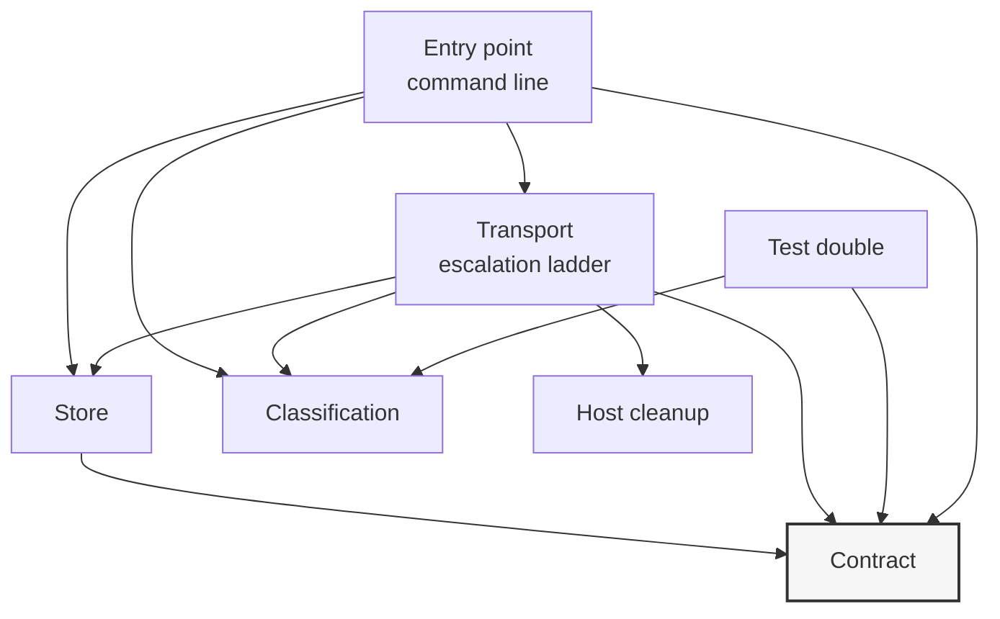

# Building Block View

## Overview

pagefetch is one importable package with a command-line entry point over
it. There is no server, no daemon and no build step: the whole system is
six modules that run inside the caller's process. Section 3 describes what
surrounds it; this chapter decomposes what is inside. The README's project
structure section is the source of truth for where the files sit — what
follows is what each part is responsible for and what depends on what.

The shape worth carrying into the detail: dependencies point inward at a
contract module that imports nothing, and the one module allowed to touch
the host is reachable only from the transport that needs it.

## Level 1: Module Decomposition

| Building block | Responsibility |
| ---------------- | ---------------- |
| **Contract** | The interface every other part is written against: the abstract page source, the options a fetch takes, the result it returns, and the two enumerations naming content forms and transports. Imports nothing from the package |
| **Classification** | Pure predicates deciding what a response body is, and the pattern lists behind them. No I/O, no configuration, no imports from the package |
| **Transport** | The four transports and the escalation order over them, plus the batch session, scheme validation and response decoding |
| **Store** | Retained page bodies on disk: key derivation, read, write, delete, enumeration and the sweep |
| **Host cleanup** | Process enumeration and termination for browsers that outlive their fetch. The only platform-specific, side-effectful part of the package |
| **Test double** | A page source backed by a map of URLs to bodies, recording what it was asked for. Part of the published surface, not a test fixture |
| **Entry point** | Argument parsing, output routing and exit status over the transport module. Holds no fetching logic |

**Why the contract imports nothing.** Every other module depends on it, so
anything it imported would become a dependency of the whole package,
including of the test double a consumer runs in their own suite. Keeping it
empty is what lets a consumer type against the interface without pulling in
classification, storage or process handling.

## Level 2: Inside the Building Blocks

### Contract

The stable surface. An abstract page source declares four operations —
fetch one URL, fetch a list, download raw bytes, capture a screenshot —
and states the contract every implementation is held to: a failed fetch
returns an unsuccessful result rather than raising.

| Type | Role |
| ------ | ------ |
| `PageSource` | The abstract base; the type a consumer depends on and substitutes |
| `FetchOptions` | Content form, transport, extra wait and whether a stored body may be served. Frozen, so one instance is safely shared across a batch |
| `FetchResult` | URL, content, the transport that produced it, and whether anything came back |
| `ContentMode` | Raw markup or markup stripped to text |
| `Transport` | Automatic escalation, or one of the four transports named explicitly |

The transport enumeration names each member for what it requires of the
caller rather than for the engine behind it. The same names appear as
command-line flags and as the reported transport, so a swapped engine
changes nothing a caller has written down.

### Classification

Three pattern lists and four predicates over them. Every predicate takes a
body and returns a verdict; none of them knows which transport produced it,
whether it came from the network or the store, or what will be done with
the answer.

| Predicate | Question it answers |
| ----------- | --------------------- |
| `is_bot_blocked` | Is this a wall, a challenge, or a throttle stub rather than a page? |
| `is_error_page` | Is this a not-found or gone page, including one served with a success status? |
| `looks_like_real_content` | Is this plausibly a page at all — neither of the above, and long enough? |
| `is_cacheable_junk` | Should this body never be served from the store? |

The last is deliberately a named function rather than an expression
repeated at its two call sites. The read path and the sweep have to agree
on what junk is, and the failure mode of disagreeing is a store that keeps
what a sweep deletes.

### Transport

The largest module, and one module on purpose: the four transports and the
order over them change together, and the order is the thing hardest to read
when it is split across files. Section boundaries inside it are marked by
comment banners rather than by files.

| Part | Role |
| ------ | ------ |
| Scheme validation | Rejects a URL that is not HTTP or HTTPS at every public entry point, before a request or a browser launch |
| Response decoding | Undoes the compressions the plain transport advertised, sniffs an undeclared one, and fails the transport for anything it cannot undo |
| Four transport methods | One per rung, each importing its engine internally and returning nothing rather than raising |
| Escalation orchestrator | Runs the ladder for the requested transport and reports which rung produced the content |
| Store access | The single read and the single write, so the "refresh, not bypass" behaviour of the no-store flag exists in one place |
| Batch session | Holds whichever browser a batch warrants and releases every handle it took, whatever the batch does |

The batch session is a small type rather than four variables because every
field in it leaks if a batch exits without releasing it. Releases are
independent: a browser that has already died must not prevent the event
loop from being closed after it.

### Store

Bodies on disk, one file per URL and content form, named by a truncated
digest of the URL plus a suffix for the form. The scheme is fixed — the
digest, its length and the suffixes are all load-bearing, and changing any
of them silently orphans every existing entry rather than failing.

| Operation | Role |
| ----------- | ------ |
| Key derivation | URL and content form to a filename |
| Read, write, delete | One entry at a time; delete is idempotent |
| Enumeration | Every stored body, filtered to names matching the key scheme |
| Sweep | Applies a caller-supplied verdict to every entry, removing or reporting |

The enumeration filter looks redundant inside a real store, where nothing
else is present to match. It is not: the sweep deletes what enumeration
returns, and a store directory that resolved somewhere unintended is
exactly the case where it must find nothing rather than read whatever files
it landed among.

The directory is validated when the store is constructed rather than at the
first write, so a path that is a file, or whose nearest existing ancestor
is missing or read-only, fails immediately and names the source that
supplied it.

### Host cleanup

The one Windows-specific part. It samples running browser processes before
a launch, and afterwards records those that are both new since the sample
and descended from the running interpreter. At process exit it signals the
survivors.

Requiring descent is the whole design. Sampling alone would claim a browser
window the user happened to open while a fetch was running. Where ancestry
cannot be established — which is every non-Windows platform — nothing is
recorded and nothing is killed.

One instance serves the process. An instance per fetcher registered an exit
handler per fetcher, none of which were ever removed.

### Test double

A page source backed by two maps, one of bodies and one of raw bytes. It
records every URL it was asked for so a consumer can assert on call
behaviour, and it derives the text form from the stored body exactly as the
real fetcher does, so a consumer exercising both forms sees them differ
under test the way they will in production.

It accepts any key as a URL, where the real fetcher rejects anything that
is not HTTP or HTTPS. The keys never reach a socket, so a test is free to
use short labels — at the cost that an unsupported scheme passes against
the double and raises against the real implementation.

### Entry point

Parsing, routing and exit status, and no fetching. Its notable property is
the order it works in: unknown flags are rejected first, then every value
flag is read, and only then does anything act. A discarded flag would
otherwise let a mistyped command run as a different one — and for the sweep
that inverts the operation, since a mistyped dry-run flag deletes.

Absence and emptiness are distinguished once, centrally. A flag given with
no value, or with an empty one, is an error rather than a silent fall back
to the default the caller was reaching past.
