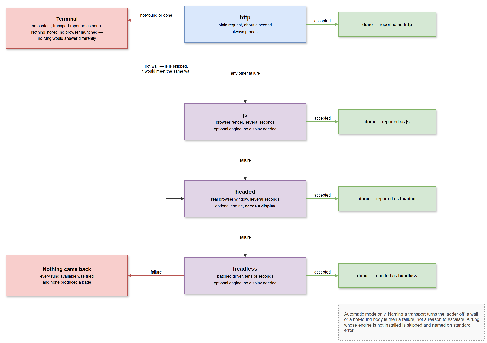
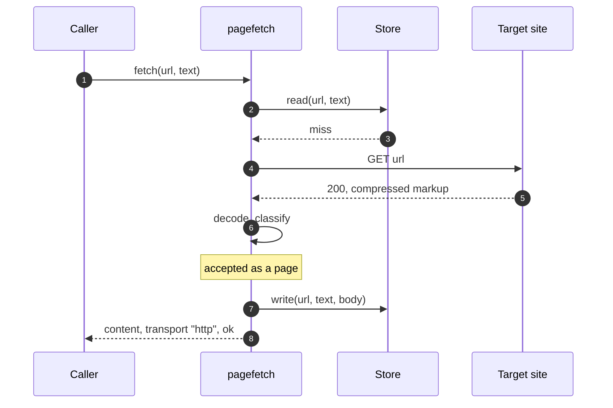
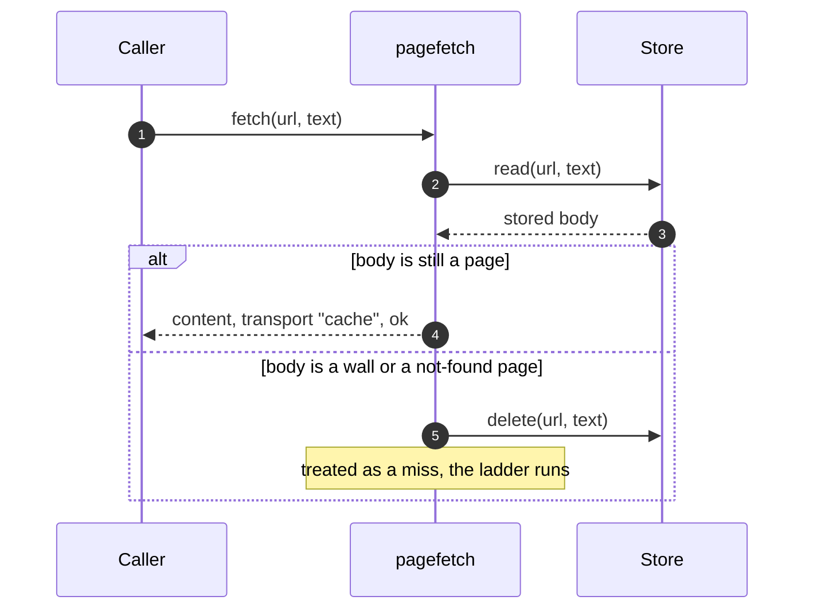
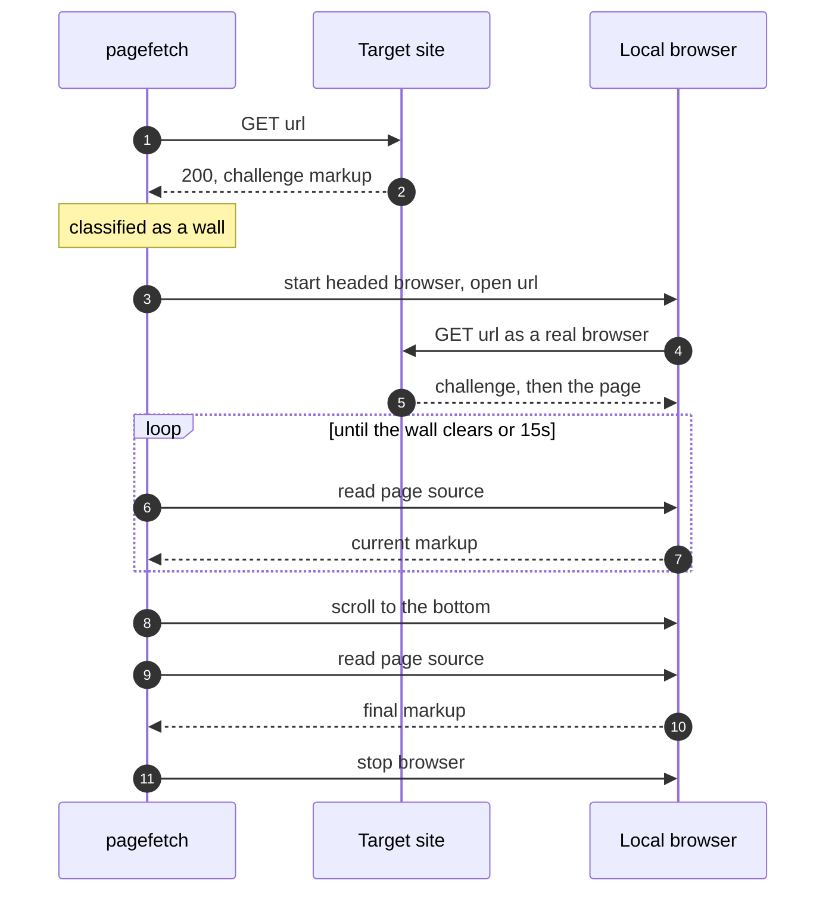
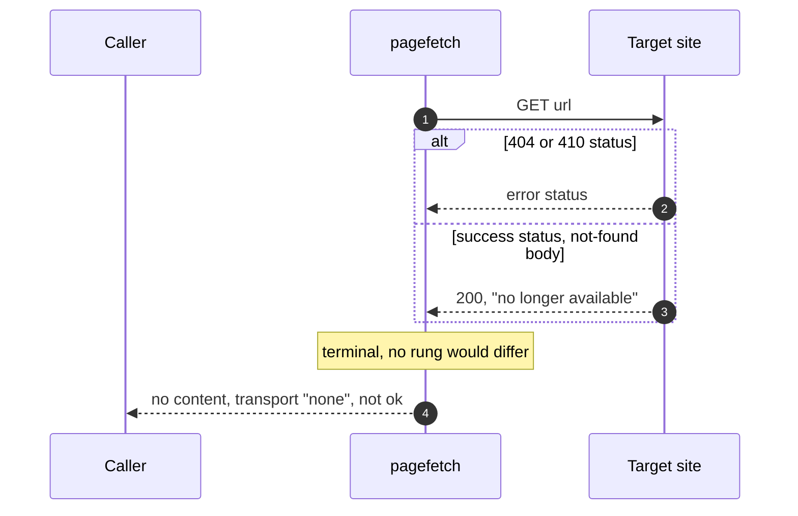
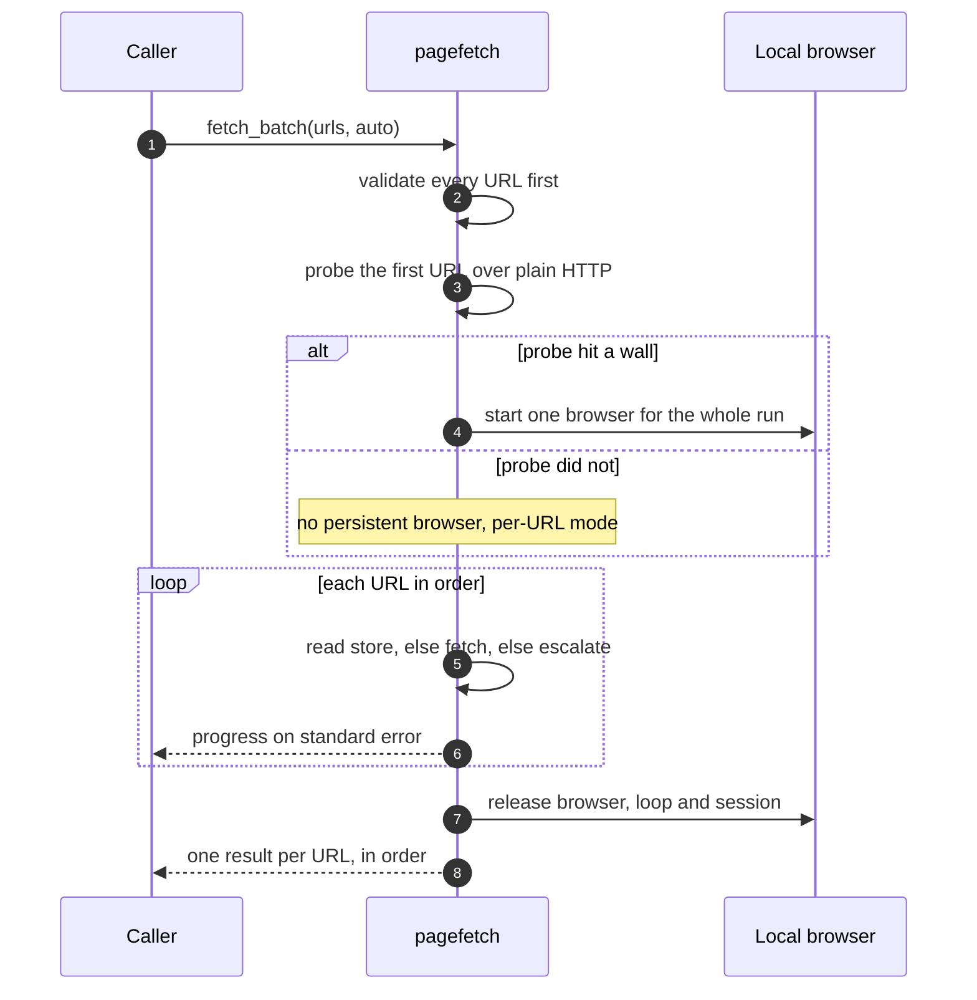

# Runtime View

## The Escalation Ladder

Every scenario below is a path through one structure. A transport either
returns a body that classification accepts, or it hands control to the next
rung.

| Transport | Engine | Cost | Display | Serves |
| ----------- | -------- | ------ | --------- | -------- |
| `http` | urllib | ~1s | not needed | Static markup, which is most pages |
| `js` | Playwright | ~5-9s | not needed | Content assembled in the browser |
| `headed` | Nodriver | ~6-8s | required | Bot walls, preferred |
| `headless` | SeleniumBase UC | ~18-24s | not needed | Bot walls with no display available |

Timings are the orders of magnitude that justify the ordering, not
measurements to hold the package to.

## Normal Operation

### A Static Page in Automatic Mode

The common case, and the one the ordering exists for: one request, no
browser, and a body kept for next time.

### A Stored Body Serves the Request

A stored body is checked before it is served, not only when it is written.
A body stored before a rule existed, or a product page that has since been
withdrawn, is deleted on read and the fetch proceeds as a miss.

### A Bot Wall on the Plain Transport

The wall is recognized in the body, and the JavaScript rung is skipped
because it would present the same client signature and meet the same wall.

Waiting is by polling, not by sleeping a fixed time. The browser is asked
for its page source on a backoff from half a second to a two-second cap,
until either the wall patterns are gone or the fifteen-second deadline
passes. Then the page is scrolled and read. Adapting to the handshake beats
guessing how long it takes.

### A Not-Found Body Ends the Fetch

Nothing is stored and no browser is launched. The verdict being terminal
is what makes the phrasing rules around it strict: a wrong verdict here
costs a page that exists, with no second opinion to correct it.

### A Batch Through One Browser

A batch decides once what it needs. Only automatic mode probes, and it
probes the first URL alone, because launching a browser for a batch that
plain requests can serve costs far more than one wasted request.

Validating the whole list before starting is deliberate: a batch can run
for minutes, and refusing a bad URL up front beats failing on URL 87 after
all that work.

### A Forced Transport

Naming a transport turns the ladder off. A wall or a not-found body is then
a failure, not a reason to escalate — a caller who ruled out browsers is
not overruled by the response.

## Process Exit

Browsers started by a fetch are stopped by that fetch, and a batch releases
its browser in a path that runs whatever else happened. What survives both
is handled at interpreter exit: the processes recorded as new since a
launch and descended from this process are signalled, and a line on
standard error says how many. Where ancestry could not be established
nothing was recorded, so nothing is signalled.

## Failure and Recovery

### An Engine Is Not Installed

The import inside the transport fails, a line naming the transport reaches
standard error, and the ladder moves to the next rung. With no engines
installed at all, the ladder is one rung and a page needing a browser
simply does not come back. This is the default install, not a broken one.

### A Response Cannot Be Decoded

A body whose declared compression the plain transport cannot undo — or a
chain of compressions, which would have to be undone in order — fails the
transport rather than being passed on. Handing those bytes back would
produce mojibake, and mojibake is comfortably larger than the size floor,
so it would pass as a page and be stored as one. Escalating beats storing
garbage.

The same reasoning runs in the other direction: a body carrying gzip's
signature is decompressed even when the response did not declare it,
because a server that compresses without saying so is not hypothetical.

### A Browser Will Not Start

In a batch, a preferred browser that fails to start falls back to the other
one, and if that is also unavailable the batch runs per URL. Every fallback
is announced on standard error. A batch with no persistent browser is a
working outcome, not a failure.

### A Transport Raises

Each transport catches broadly and returns nothing. A missing browser
binary, a dropped debug connection or a driver crash costs one rung rather
than the fetch. This is why the escalation module carries an exemption from
the lint rule against broad exception handling: narrowing it would couple
the ladder to each engine's exception hierarchy, which is the coupling the
abstract page source exists to avoid.
