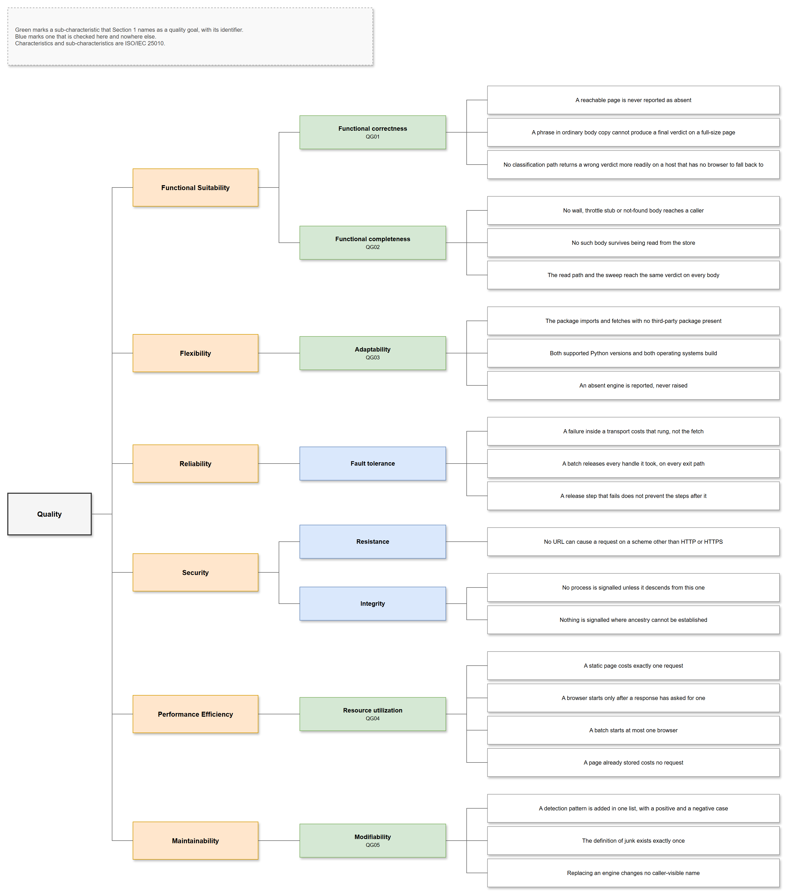

# Quality Requirements

## Quality Tree

The tree groups every quality requirement by ISO/IEC 25010 characteristic
and sub-characteristic. A goal identifier marks the ones Section 1 names as
driving the architecture; the rest are checked here and nowhere else. Each
leaf is worded so that a single observation can falsify it.

## Quality Scenarios

Q1 to Q14 are usage scenarios: a stimulus at runtime, and the response
expected. Q15 and Q16 are change scenarios, where the response is what a
maintainer has to touch.

| ID | Quality | Scenario | Expected Response | Priority |
| ---- | --------- | ---------- | ------------------- | ---------- |
| Q1 | Functional Suitability | A 17 KB product page says "the silver finish is no longer available" in its body copy | The page is returned as content. The phrase carries weight only below the size floor | High |
| Q2 | Functional Suitability | A 6 KB stub says "no longer available" and nothing else of substance | Final verdict: no escalation, nothing stored, no content, non-zero status | High |
| Q3 | Functional Suitability | A page over the floor renders half its content in JavaScript, fetched in automatic mode | The partial body is returned and stored under the key a complete body would use. This is accepted behaviour, not a defect — a caller needing completeness names the JavaScript transport | Medium |
| Q4 | Functional Suitability | The plain transport receives a 7 KB throttle page carrying no recognizable wording | Rejected by the size floor, escalated rather than returned or stored | High |
| Q5 | Functional Suitability | The store holds a wall body written before the guard for it existed | Deleted on read and the fetch proceeds as a miss; a later sweep finds nothing left to remove | High |
| Q6 | Functional Suitability | A server compresses a response with gzip without declaring it | Decompressed by signature. Mojibake is neither returned nor stored | High |
| Q7 | Flexibility | The package is installed with no optional engines, and a URL behind a wall is fetched | The wall is detected, each browser rung reports itself absent, no content is returned and the status is non-zero. No traceback | High |
| Q8 | Reliability | A browser engine crashes part-way through a batch | The batch continues to the remaining URLs, and the browser, event loop and session are all released | High |
| Q9 | Reliability | A batch's browser has already died when the batch releases its handles | The remaining release steps still run, and the failure is reported rather than raised | Medium |
| Q10 | Security | A caller passes a URL with a `file` scheme, singly and inside a batch | `ValueError` before any request is issued or any browser is launched, on both paths | High |
| Q11 | Security | A user opens a browser window while a fetch is running | That window is never signalled, at exit or otherwise | High |
| Q12 | Security | The operating system cannot report a process's parent | Nothing is recorded and nothing is signalled. A browser may be left behind, which is the accepted direction to fail in | Medium |
| Q13 | Performance Efficiency | The same URL and content form is fetched twice | The second fetch issues no request and reports the store as its source | High |
| Q14 | Performance Efficiency | A batch of URLs that plain requests can all serve is fetched in automatic mode | No browser is started. One extra plain request is spent today: the mode probes the first URL to decide, discards the body, and the loop then fetches that URL again | Medium |
| Q15 | Maintainability | A detection pattern is added | One list changes, with a positive case and a negative case proving it does not fire on real content, and the pattern-count assertions updated | Medium |
| Q16 | Maintainability | An engine is replaced behind a transport | No enumeration member, command-line flag, reported transport or narration prefix changes | Medium |

## Test Coverage

The suite runs with no network and no browser, so what it can reach is
bounded by design rather than by effort. Escalation is exercised by
substituting the four transport methods, which makes the ordering testable
without any engine installed; the method bodies themselves need a real
browser and are validated by hand.

| Scope | Target |
| ------- | -------- |
| Classification predicates | Every pattern has a positive case and a negative case on real content; all three list lengths asserted |
| Escalation ordering | Every path through the ladder, including the skipped rung and the terminal verdict |
| Store behaviour | Read, write, delete, enumeration filtering, the read-time scrub and the sweep in both modes |
| Command-line surface | Flag parsing, empty and missing values, unknown flags, and all three exit statuses |
| Process cleanup | The ancestry walk against a constructed process table, on both operating systems |
| Browser transport bodies | Not covered; validated by hand on a desktop with a display |
| Whole package | A floor enforced on every matrix leg, raised against the measured figure and never lowered to make a change pass |

### Sites Exercised by Hand

The hand validation named in the row above has been carried out against
these sites:

| Site | Transport | Notes |
| ------ | ----------- | ------- |
| allphotolenses.com | `http` | Static markup |
| ttartisan.com | `js` | Rendered in the browser, query-parameter routing |
| zyoptics.net | `headed` | Captcha and bot protection |
| bhphotovideo.com | `headed` | Clears a challenge with a real window |
| viltrox.com | `http` | Static markup plus a JSON endpoint |
| mobile01.com | `headless` | Blocks plain headless browsers |
| adorama.com | none | Press-and-hold challenge; manual only |

The column records which transport *succeeded*, not which ones were tried
and failed. That makes the table weak evidence for the claim it looks like
it supports — that the two bypass transports cover different sites — and it
is the reason the split between them rests on their costs rather than on
this table.
